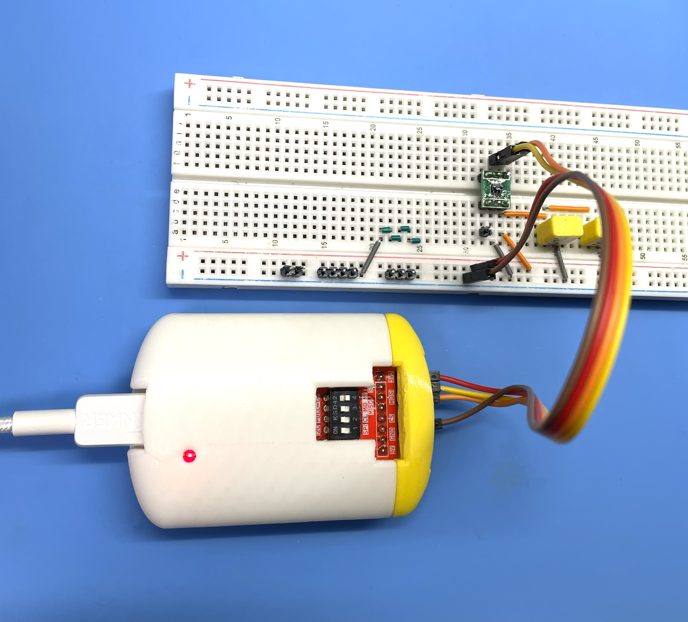

# USB-I2C/SPI Adapter Hardware Design

  

    
  

## Overview

This directory contains the hardware design files for a USB-I2C/SPI adapter based on the FTDI FT232H chip. The adapter enables USB connectivity for I2C and SPI communication with various embedded devices and sensors.

## Hardware Features

- **USB Interface**: USB 2.0 Full Speed (12 Mbps)
- **Main Controller**: FTDI FT232H (MPSSE capable)
- **Protocols Supported**: I2C, SPI, GPIO
- **USB-C Connector**: Modern USB Type-C connection
- **Operating Voltage**: 3.3V I/O (5V USB powered)
- **Compact Design**: Optimized PCB layout for ease of use

## Design Files

This repository includes the following KiCad project files:

| File | Description |
|------|-------------|
| `i2cmaster.kicad_sch` | Schematic design file |
| `i2cmaster.kicad_pcb` | PCB layout file |
| `i2cmaster.kicad_pro` | KiCad project file |
| `i2cmaster.csv` | Bill of Materials (BOM) |
| `fp-lib-table` | Footprint library table |
| `Library.pretty/` | Custom footprint library |

## Production Files

The `i2cmaster.kicad_pcb_gerber.zip` is Gerber files and production data for PCB manufacturing.

## Key Components

- **FT232H**: FTDI USB-to-MPSSE bridge chip
- **USB-C Connector**: 5077CR-16-SMC2-BK-TR (USB Type-C receptacle)
- **Voltage Regulator**: 3.3V LDO for I/O interface
- **ESD Protection**: Protection circuitry for USB lines
- **Pull-up Resistors**: I2C bus pull-up resistors (typically 4.7kΩ)

## Pin Configuration

The adapter connector has the following pin assignments:

| Pin | Signal | Description |
|-----|--------|-------------|
| 1 | +3.3V | 3.3V power output (limited current) |
| 2 | SCLK/SCL | SPI Clock / I2C Clock |
| 3 | MOSI/SDA | SPI Master Out / I2C Data (OUT in I2C mode) |
| 4 | MISO/SDA | SPI Master In / I2C Data (IN in I2C mode) |
| 5 | CS/DB3 | SPI Chip Select / GPIO DB3 |
| 6 | GND | Ground |
| 7 | GND | Ground |
| 8 | +5V | 5V power output (limited current) |

## DIP Switch Configuration

The adapter includes DIP switches to configure operation mode and pull-up resistors:

| Switch | Position | Function |
|--------|----------|----------|
| S1 | ON | I2C mode (PIN3 and PIN4 connected, PIN3=OUT, PIN4=IN) |
| S1 | OFF | SPI mode (separate MOSI/MISO signals) |
| S2 | ON | SCLK/SCL pull-up resistor enabled |
| S3 | ON | MOSI/SDA pull-up resistor enabled |
| S4 | ON | MISO/SDA pull-up resistor enabled |

**Note**: When S1 is ON (I2C mode), PIN3 and PIN4 are internally connected to form a bidirectional SDA line, with PIN3 functioning as output and PIN4 as input.

## Software Compatibility

This hardware design is compatible with:

- FTDI D2XX drivers (Windows/Linux/macOS)
- libFTDI (open-source alternative)
- Custom applications using MPSSE commands
- Windows GUI application (see [UsbI2cController](https://github.com/hnz1102/UsbI2cController) for software documentation)

## Design Tools

- **KiCad 9.x or later**: PCB design and schematic capture
- **KiCad EDA**: Free and open-source electronics design automation suite

## Opening the Project

1. Install [KiCad](https://www.kicad.org/) (version 9.0 or later recommended)
2. Open the project file: `i2cmaster.kicad_pro`
3. Schematic: Double-click `i2cmaster.kicad_sch`
4. PCB Layout: Double-click `i2cmaster.kicad_pcb`

## Manufacturing

### PCB Specifications

- **Layers**: 2-layer PCB
- **Board Thickness**: 1.6mm (standard)
- **Copper Weight**: 1 oz (35 μm)
- **Surface Finish**: ENIG or HASL
- **Solder Mask**: Green (or custom color)
- **Silkscreen**: White

## Electrical Characteristics

- **USB Power Input**: 5V ± 5%
- **I/O Voltage Level**: 3.3V CMOS
- **Maximum I/O Current**: Refer to FT232H datasheet
- **I2C Clock Speed**: Up to 400 kHz (Fast Mode) or 3.4 MHz (High-Speed Mode)
- **SPI Clock Speed**: Up to 30 MHz

## License

This Hardware Schematic documents are licensed under CC-BY-SA V4.0.

## References

- [FTDI FT232H Datasheet](https://ftdichip.com/wp-content/uploads/2020/07/DS_FT232H.pdf)
- [FTDI Application Notes](https://ftdichip.com/document/application-notes/)
- [KiCad Documentation](https://docs.kicad.org/)

## Changelog

- **2025-12-26**: Initial hardware design with USB-C connector
- Production files generated for PCB manufacturing
